# The IPK IOTA project documentation

Documentation for the second IPK project, IOTA version: Chat server using `IPK24-CHAT` protocol.

## Table of Contents

-   [Introduction](#the-ipk-iota-project-documentation)
-	[Executive summary](#executive-summary)
-   [Program execution](#program-execution)
-   [Implementation](#implementation)
-   [Testing](#testing)
-   [Bibliography](#bibliography) 

## Executive summary

The program implements a server part of char server using `IPK24-CHAT` protocol. It implements communication with client using two different protocoles:
* The Transmission Control Protocol (TCP) is a transport protocol that is used on top of IP to ensure reliable transmission of packets. TCP includes mechanisms to solve many of the problems that arise from packet-based messaging, such as lost packets, out of order packets, duplicate packets, and corrupted packets.
* The User Datagram Protocol, or UDP, is a communication protocol used across the Internet for especially time-sensitive transmissions such as video playback or DNS lookups. It speeds up communications by not formally establishing a connection before data is transferred.

The program is written in C#, using .net8.0.

## Program execution and usage

The program "ipk24chat-server" accepts the following set of parameters:
* -l {ip} - sets listening IP address for welcome sockets (0.0.0.0 by default)
* -p {port} - sets listening port for welcome sockets (4567 by default)
* -d {ms} - sets UDP confirmation timeout in ms (250 by default)
* -r {count} - sets maximum number of UDP retransmissions (3 by default)
* -h - prints the help message and finishes the program

Just after the program execution (if CLA parameters were processed successfully), starting of welcome UDP and TCP listeners happens, and server is ready to receive messages from users.

## Implementation

Project contains few functional parts:
* Channels - implements communication between users.
* Welcome session - waits for new users and creates sessions for them.
* TCP user sessions - implements communication for TCP users.
* UDP user sessions - implements communicaation for UDP users.
* Inner mechanisms - mechanisms for message encoding and decoding, logging incoming and outcoming messages, error handling.

### Channels
There is a special class, which contains attributes and methods for channel implementatiom. Objects of that class store the list of currently connected users, and are able to connect and disconnect users, and send messages to them.

Channels may be instant or temporary. There is only one instant channel: "general". It means that existence of that channel does not depend on count of connected users. Temporary channel stops to exist when the last user leaves.

### Welcome session 

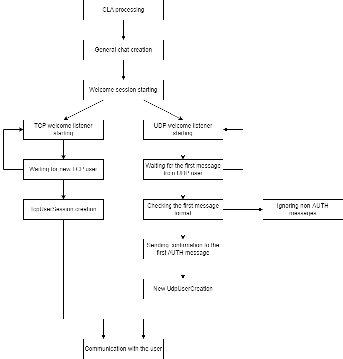

### TCP user session

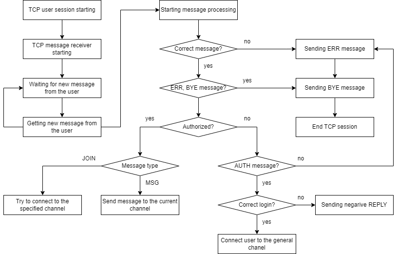

### UDP user session

UDP user sessions have almost the same logic as TCP user sessions, but there are few differences: the first message processing and confirmation mechanisms.

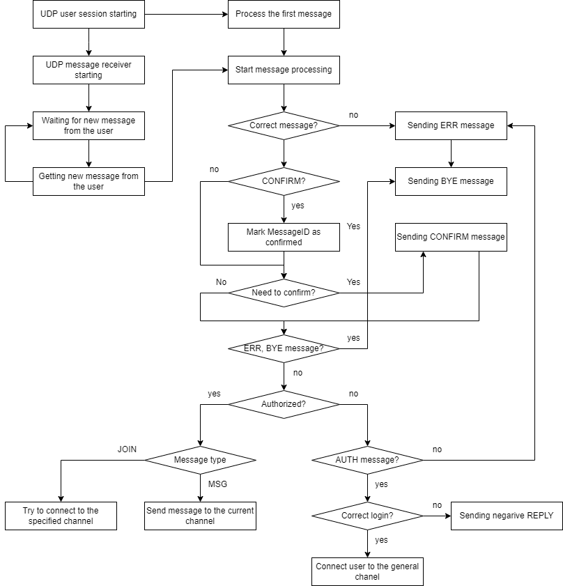

## Testing

Project was tested on a custom reference environment, using xUnit NuGet package and the client written in the first IPK project.

### Inner mechanisms testing

Inner mechanisms were tested on Windows 11, in Visual Studio 2022, with xUnit NuGet package.

#### Command Line Arguments processing tests
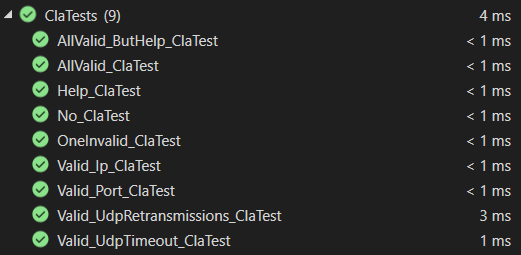

#### Log messages tests
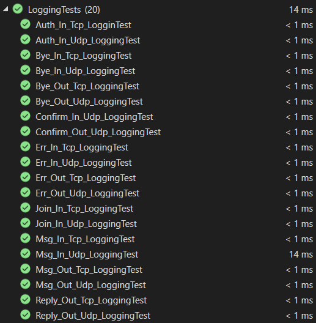

#### TCP messages encoding and decoding tests
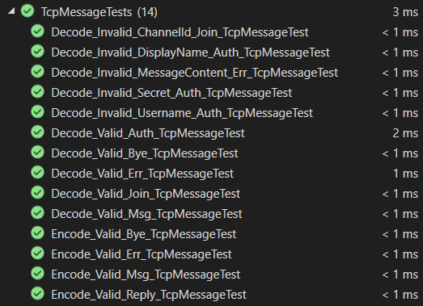

#### UDP messages encoding and decoding tests
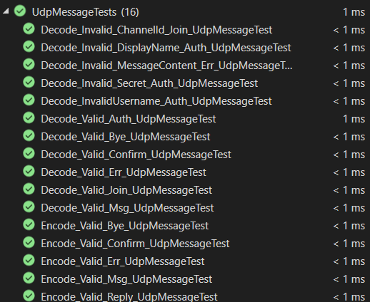

### Communication with user and channels tests

The main server functions were tested on custom reference environment, with client from the first IPK project.

#### User connection, authorization, and disconnection
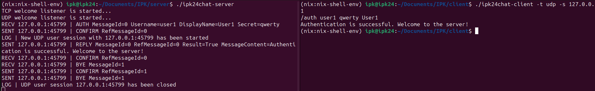

#### Communication between UDP and TCP users, joining new channel
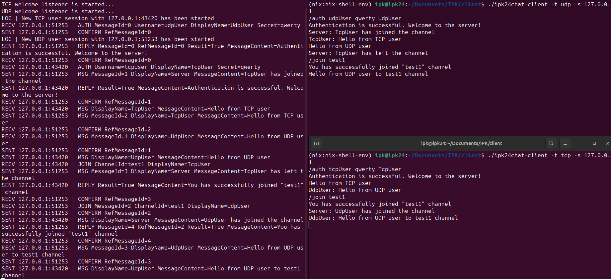

#### Renaming
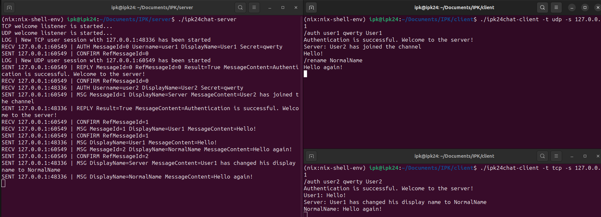

#### Four users at the same time
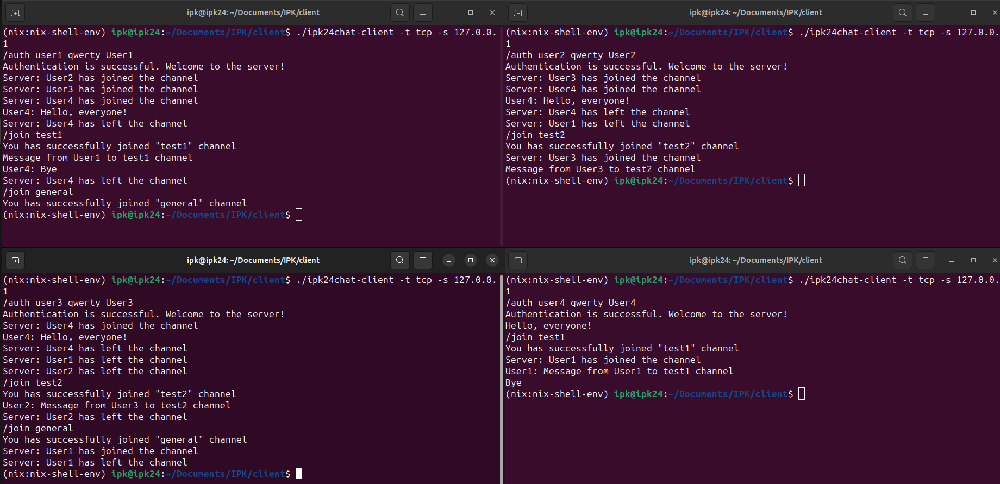

#### Trying to join already joined channel
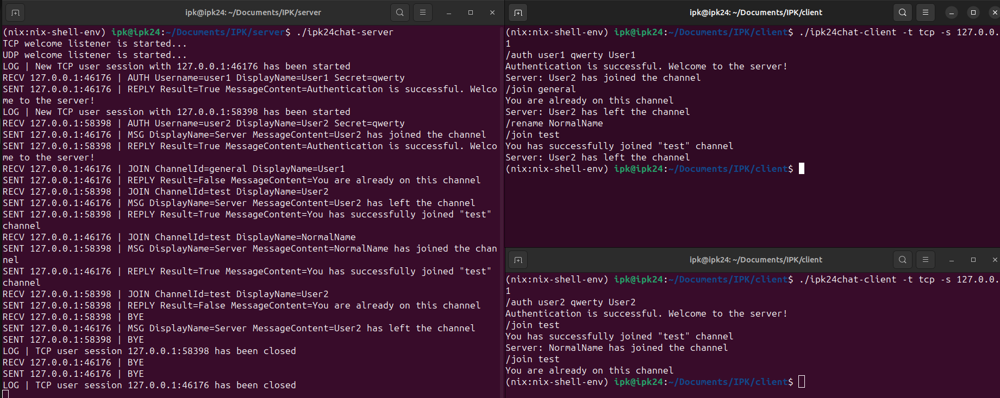

#### Trying to authorize with already authorized username
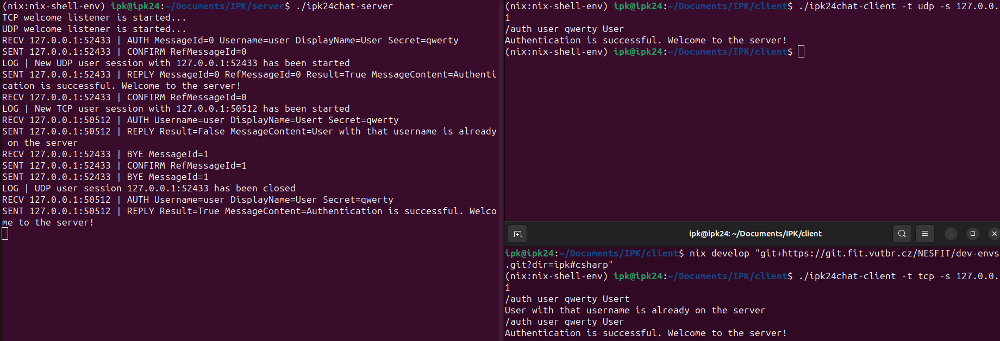

## Bibliography

Wikipedia, User Datagram Protocol: https://en.wikipedia.org/wiki/User_Datagram_Protocol

Wikipedia, Transmission Control Protocol: https://en.wikipedia.org/wiki/Transmission_Control_Protocol

Microsoft Learn, .NET: https://learn.microsoft.com/en-us/dotnet/